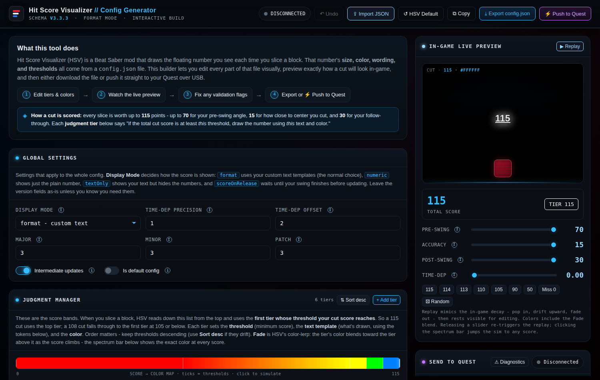

# HSV Config Generator

**A visual editor, live simulator, and USB deployment tool for Beat Saber's HitScoreVisualizer mod — in a single HTML file.**

### **[▶ Open the app](https://spanky3651.github.io/hsv-generator/)**

---

## What is this?

[HitScoreVisualizer (HSV)](https://github.com/ErisApps/HitScoreVisualizer) is the Beat Saber mod that draws the floating score you see every time you slice a block. Everything about that popup — its size, color, wording, and the score bands that trigger each style — comes from a `config.json` file that people normally edit by hand, guessing at RGBA float arrays and re-launching the game to see the result.

This tool replaces that loop. You edit every part of the config visually, watch a faithful simulation of how each cut will render in-game, and then either download the file or push it **straight onto a Quest headset over USB** — no BMBF, no SideQuest, no file manager.

## Features

- **Judgment tier manager** — add, reorder (drag or nudge), duplicate, and delete score bands, with color pickers, typeable hex fields, and per-tier alpha sliders
- **Live in-game preview** — a simulated cut renders your actual config, including TextMeshPro rich-text tags (`<size>`, `<color>`, `<u>`…), with the float-up-and-fade decay animation from VR
- **Score → color spectrum bar** — every score from 0–115 mapped to the exact color your config produces, including Fade blends; click anywhere to simulate that score
- **Fade done right** — HSV's `fade` flag is a *color lerp* between adjacent tiers, not a fade-out; the preview and spectrum both model it
- **Full simulator** — independent pre-swing / accuracy / post-swing / time-dependency sliders, preset buttons, and one-click random cuts
- **Push to Quest over WebUSB** — speaks ADB from the browser (the same approach as ModsBeforeFriday), with device info, config-folder detection, editable destination path and filename
- **USB conflict diagnostics** — detects the classic "interface claim failed" lock caused by SideQuest / Quest Link / Android Studio holding the ADB server, and walks you through fixing it with one-click-copyable kill commands
- **Validation** — duplicate or unreachable thresholds, out-of-range sub-judgments, missing catch-alls, unclosed rich-text tags, missing tokens
- **Import / export with fidelity** — unknown keys from other tools' configs are preserved untouched; 0–255 color arrays are auto-normalized; BOM'd files import cleanly
- **Quality of life** — 30-level undo, two-step deletes, an editable live JSON panel, Ctrl+S export, and an ⓘ explainer on every single control

## How it works

Every Beat Saber cut is scored out of **115**: up to **70** for pre-swing angle, **15** for cut accuracy (distance from block center), and **30** for follow-through. HSV walks your judgment list top-down and uses the first tier whose threshold the total reaches, then renders that tier's text template.

Templates mix literal text, TextMeshPro tags, and tokens:

| Token | Meaning |
|-------|---------|
| `%s` | total cut score |
| `%b` / `%c` / `%a` | raw pre-swing / accuracy / post-swing values |
| `%B` / `%C` / `%A` | substituted text from the sub-judgment lists |
| `%d` / `%T` | time-dependency value / text |
| `%n` | newline |
| `%p` | percent of 115 |

The generator opens with the **official HSV default template** (taken from the mod's source, including its trick of opening a `<u>` tag via `%C` so underline only appears on max-accuracy cuts). Everything is a plain HTML file with inline CSS/JS — no frameworks, no build step, no server. Open it from disk or from the live URL; both work identically. The only feature that needs the network is Push to Quest, which loads the [ya-webadb](https://github.com/yume-chan/ya-webadb) ADB stack from a CDN on first use.

## Push to Quest

Requirements: **Chrome or Edge on desktop**, a USB-C data cable, and a Quest with **Developer Mode** enabled (Meta Quest phone app → your headset → Developer Mode).

1. Plug in the headset and click **Connect** — pick the Quest in the browser's device list
2. Approve **"Allow USB debugging"** inside the headset (tick *Always allow*)
3. Click **Push config** — the file lands in `/sdcard/ModData/com.beatgames.beatsaber/Mods/HitScoreVisualizer/Configs/`
4. In Beat Saber: Mods → HitScoreVisualizer → select the config

If the connection fails with a claim/busy error, another ADB server owns the device — quit SideQuest / Quest Link / Android Studio, run `adb kill-server`, replug, and retry. The app's **⚠ Diagnostics** panel walks through exactly this.

## Running locally

Download `index.html`, double-click it. That's the whole install.

---

**Developed by [MSploit](https://beatleader.com/u/76561199153577883)** · [BeatLeader profile](https://beatleader.com/u/76561199153577883)

*Not affiliated with Beat Games or the HitScoreVisualizer maintainers.*

